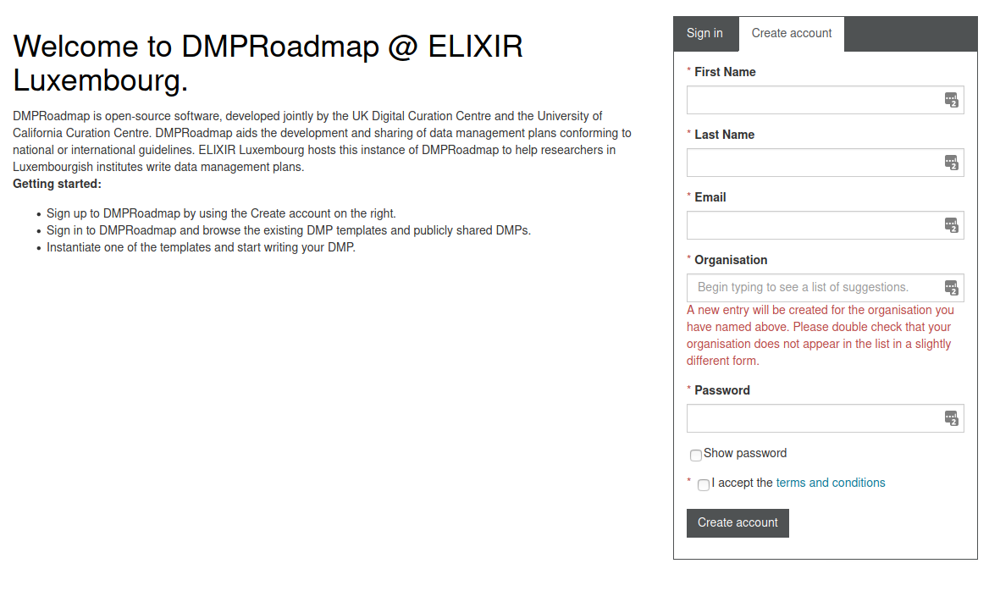
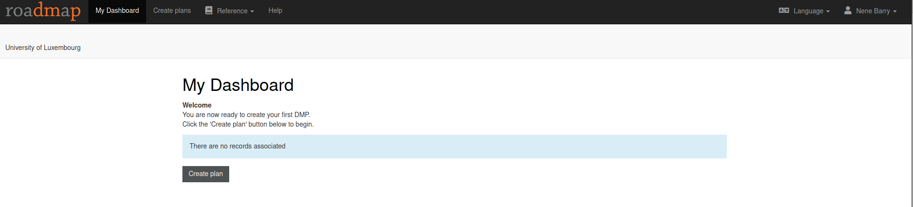
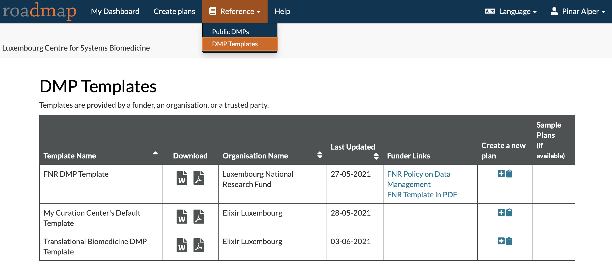
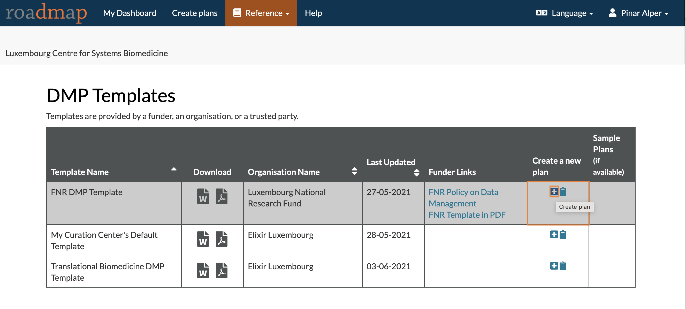
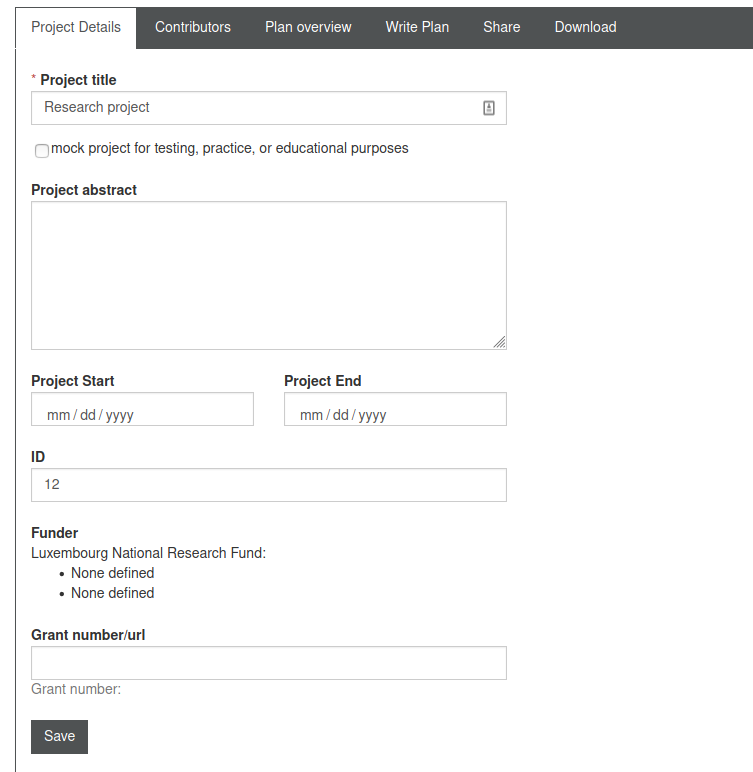
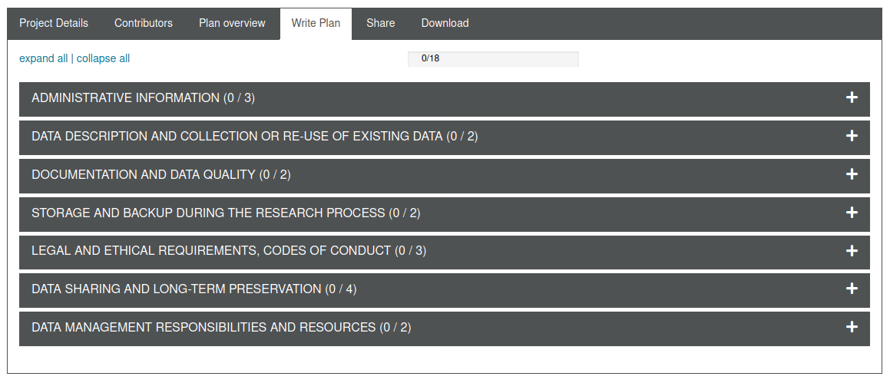
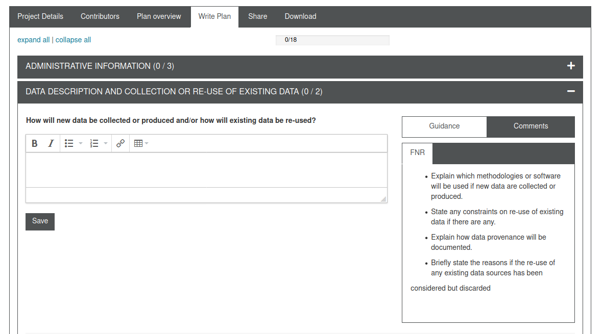
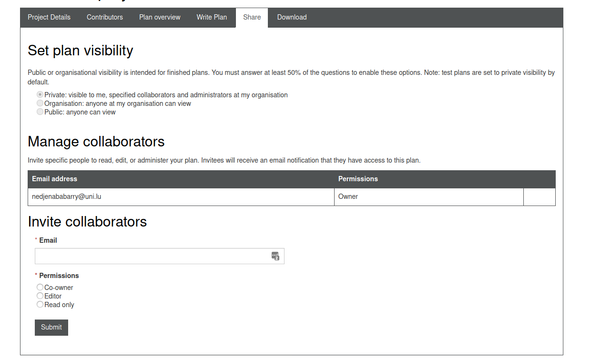
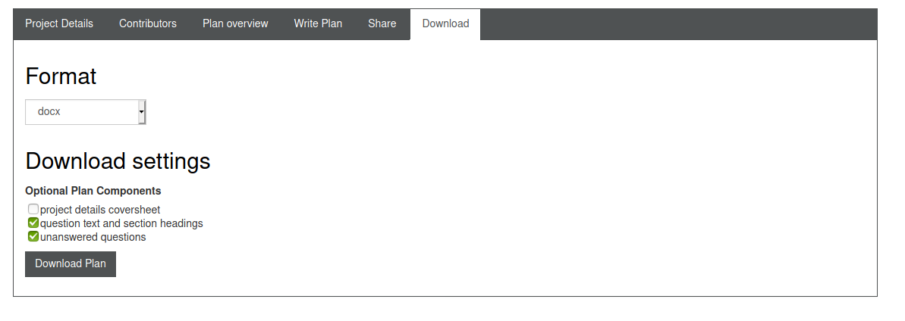

# dmponline-practical
Material for the practical session of the DMP part of the ELIXIR LU training

The DMPRoadmap tool allows you to write, review and share your data management plan according to the requirements of your research project. In this practical, you will complete a questionnaire based on the FNR template whose policy is aligned with the core requirements for data management plans as defined in the [Science Europe practical guide to the international alignment of Research Data Management](https://www.scienceeurope.org/our-resources/practical-guide-to-the-international-alignment-of-research-data-management/).Considering these different questions as a guide to meet the needs and specifics of your project.

## Required material

Before starting the practical, make sure you have the following ready:

* The [example scenario](https://github.com/elixir-luxembourg/DS-DM-training/blob/master/resources/DM-DP_RunningExample.pdf) for our workshop.
* Access to the [ELIXIR Luxembourg DMPRoadmap instance](https://dmponline.elixir-luxembourg.org/).

## Step 1: Create your account

* Go to ELIXIR Luxembourg's DMPRoadmap instance. On the top right of the main page select the `Create account` button. 
* Provide the required information and create your account. For the organisation, start typing the name of your organisation and make a selection from the list that appears, for example: "University of Luxembourg". If your organisation does not appear in the list, an organisation will be created under the name you would enter.        

## Step 2 : create your plan

* Login to DMPRoadmap, and you will be on the `My Dashboard` page. The tool has internationalisation support, and you may choose from a number of languages (top right).       
* To start creating your Plan, select `DMP Templates` under `Reference` from the navigation bar at the top.
* You will see the table of templates provided in ELIXIR Luxembourg's DMPRoadmap instance. These are:
    * Luxembourg National Research Fund - FNR's DMP template
    * Luxembourg Centre for Systems Biomedicine - LCSB's Translational Biomedicine Projects DMP template.       
* To create an empty DMP from the FNR template click on the plus icon in the `Create new plan` column for this template.      
* The next page will show you different features that will allow you to edit your plan (project details, adding contributors, and your plan overview). The plan overview will show you the context of your DMP plan, the different sections with questions that will allow you to refine the writing of your DMP.       
* You can start writing your plan by clicking on the `Write Plan` button, which will show you an overview of the different sections of your plan.        
* For each section you have several questions, and for each question, as you can see on the left menu, the tool gives guidance on the content of the answers you can bring. It also provides a `comments` part, in which you can add comments to share with your collaborators.        
* Do not forget to save your answers from time to time.

## Step 3 : Share and download your plan.

* After completing the questionnaire, click on the `share` button on the top menu. The plan is automatically set to private. You can share it with your collaborators by adding their email, while defining the rights you wish to grant them (co-owner, editor, read-only). Click on the `submit` button when finished.        
* You can download your plan in the desired format by clicking on the `download` button.        
